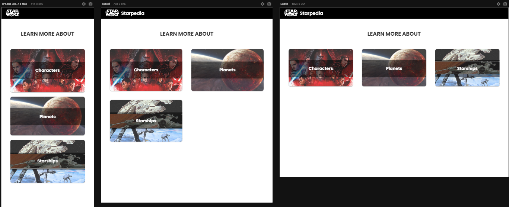
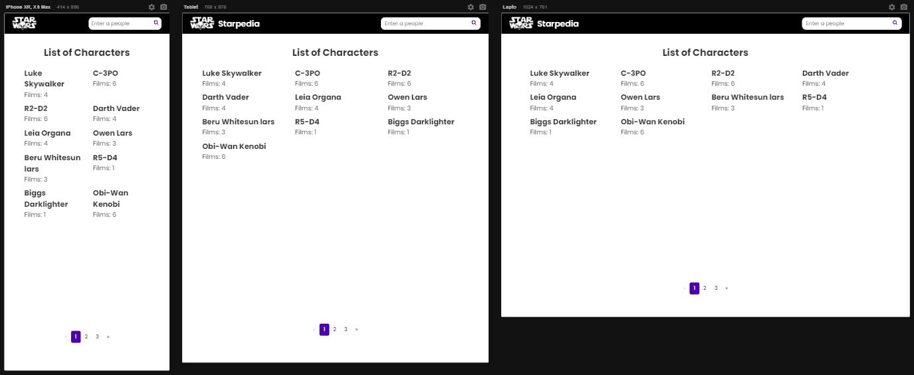
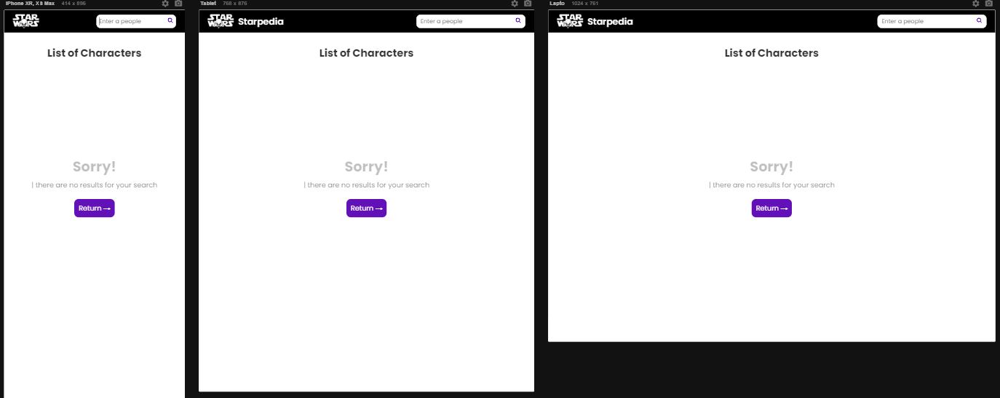
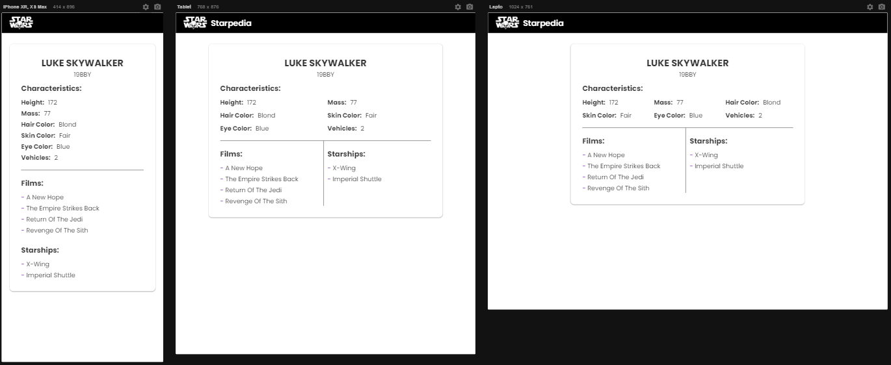
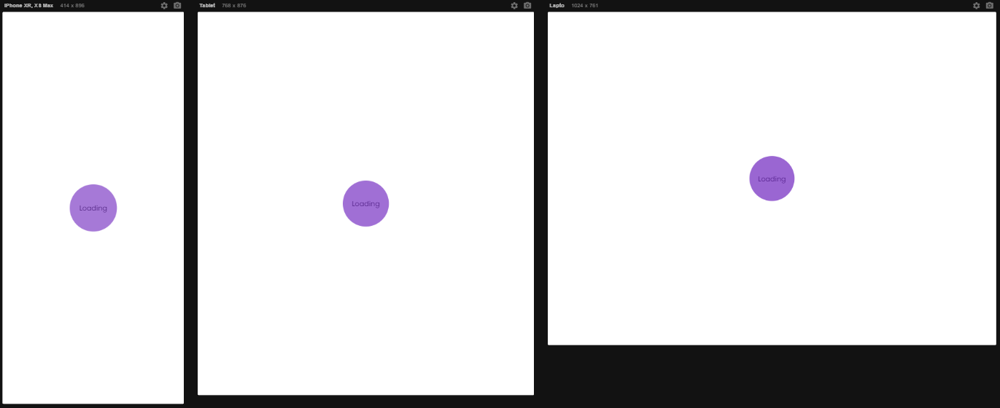
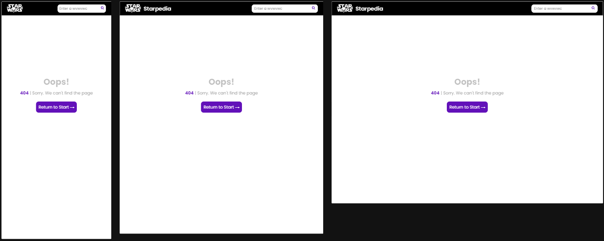

# STARTPEDIA

  Esta aplicación se desarrollo utilizando React v18, React Router V6 y Javascript, los componentes y funciones se encuentran testeados con Vitest, la aplicacion es responsiva, su estructura se organiza por funcionalidad.


<details>
<summary>Estructura de Carpetas</summary>

```bash 
├── src/
│ ├── client/
| | ├── mappers/...
│ | └── index.js
| |
│ ├── components/
│ │ ├── category/
│ │ │ ├── index.jsx
│ │ │ ├── styles.scss
│ │ │ └── index.spec.jsx
│ │ ├── categoryDetail/...
│ │ ├── home/...
│ │ ├── layout/...
│ │ ├── loading/...
│ │ ├── navbar/...
│ │ ├── notFound/...
│ │ └── ui/
| |   ├── alert/
| |   | ├── index.jsx
| |   | ├── styles.scss
| |   | └── index.spec.jsx
│ │   ├── cardEmpty/...
│ │   ├── cardMedia/...
│ │   ├── pagination/...
│ │   └── search/...
| |
│ ├── constants/
│ │ ├── alert.js
│ │ ├── category.js
│ │ └── regex.js
| |
│ ├── hooks/
| | ├── useDebounce/
│ │ │ ├── index.jsx
│ │ │ └── index.spec.jsx
│ │ └── useQueryParams/...
│ │
| ├── routes/
| | ├── loaders/...
| | ├── mappers/...
│ │ └── index.jsx
│ │
│ ├── styles/
| | ├── breackpoints.scss
│ | ├── globals.scss
│ | ├── mixins.scss
│ | └── variables.scss
│ │
│ ├── utils/
| | ├── LogErros/
│ │ │ ├── index.js
│ │ │ └── index.spec.js
| | ├── regex/...
│ │ └── strings/...
| |
| |
| └── wordings/
│   └── index.js
|
├── App.js
├── main.js
├── package.json
├── README.md
└── ...
```

</details>

<br>

### Tecnologías Utilizadas

* #### React
* #### React Router
* #### Javascript
* #### Sass
* #### Vitest
<br>

#### Cómo Probar

* Primero crea un nuevo archivo en la base del proyecto llamado ```.env``` y agrega las variables de entorno.
* En la terminal del proyecto, ejecuta el siguiente comando para instalar las dependencias: ```npm install```.
* Una vez finalizada la instalación, inicia el proyecto con el siguiente comando: ```npm run dev```.
* Si deseas ejecutar las pruebas, utiliza: ```npm run test```
<br>

### Pantalla y Opciones

* ### Página de Inicio

La página de inicio cuenta con un banner de categorías para seleccionar, el cual lo redirigirá a la pantalla de esa categoría.

<br>

<br>

* ### Listado de categorias

Esta pantalla cuenta con un listado organizado de elementos según la categoría seleccionada. Además, dispone de un buscador para filtrar por nombre.

En caso de que surja un error del servidor al realizar el filtrado, se mostrará una alerta para informar al usuario y se mantendrá la vista anterior. Si la búsqueda devuelve una lista vacía, se mostrará un mensaje informativo y se ofrecerá la opción de regresar a la vista inicial de la categoría.

<br>


<br>

* ### Detalle de categoria

En esta pantalla se presentan las características y el listado de recursos disponibles para explorar, tales como películas, naves, personajes, entre otros.

<br>

<br>

* ### Pagina de Carga

Esta vista se utiliza durante los procesos de redirección y carga de datos.

<br>

<br>

* ### Page de Error

En caso de que ocurra un error al cargar un módulo o al intentar acceder a una página inexistente, se mostrará esta vista. Para regresar a la página de inicio, simplemente haz clic en el logotipo ubicado en la esquina superior izquierda o utiliza el botón de retorno.

<br>

<br>

### Particularidades

#### Debounce

* Paginación: Se aplicó un efecto debounce de 300ms al paginado para optimizar las peticiones. Esto asegura que solo se realice la petición del último ítem seleccionado después de un breve período de tiempo.

* Buscador: Para mejorar la eficiencia de las búsquedas, se implementó un efecto debounce que retrasa la llamada hasta que haya un tiempo de inactividad. Sin embargo, también se ofrece la opción de realizar la búsqueda manualmente haciendo clic en el ícono de la lupa.

#### Parámetros en la URL

Los parámetros de filtrado, como el ID o la búsqueda realizada por el usuario en el campo de búsqueda, así como la página actualmente visualizada, se mantienen en la URL. Esto permite recargar la página o compartir la URL y mantener la vista actual.
